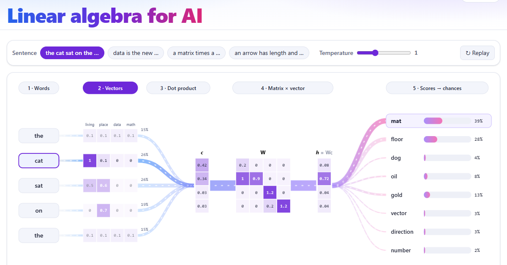

# Interactive Linear Algebra for AI/ML

**Live site: https://premuthung.github.io/Linear_algebra/**

[](https://premuthung.github.io/Linear_algebra/)

One sentence flows through a small language model in five steps:

1. **Words** – the sentence is cut into words.
2. **Vectors** – each word becomes a list of four numbers (living, place, data, math).
3. **Dot product** – the last word is compared with every word; the shares say how much each one counts, and the word vectors are mixed into one vector **c**.
4. **Matrix × vector** – the weight matrix **W** turns **c** into **h = Wc**.
5. **Scores → chances** – a dot product with every answer word, then softmax. For "the cat sat on the …" the best guess is **mat** (39%).

On the live site every step is clickable and shows its arithmetic with the live numbers.

A web app that teaches linear algebra by doing, not reading. You type numbers, drag arrows on an
x–y plane, and watch what happens to the coordinates. Each lesson ends with "Where is this in AI?".

The full plan is in [linear-algebra-interactive-spec.md](linear-algebra-interactive-spec.md).

## Run it

```bash
npm install
npm run dev        # open the printed http://localhost:5173 link
```

## Test it

```bash
npm test           # unit tests for the math core (Vitest)
npm run test:e2e   # one smoke test per lesson (Playwright)
npm run check      # type-check + lint + format check + unit tests
```

The Playwright tests use the Chrome that is already installed on your computer, so no browser
download is needed. To use Edge instead, set `PW_CHANNEL=msedge`.

## What is built

| Phase | Content                                                        | Status      |
| ----- | -------------------------------------------------------------- | ----------- |
| 0     | Vite + React + TypeScript + Tailwind, routing, progress store  | Done        |
| 1     | Math core in `src/core`, fully unit-tested                     | Done        |
| 2     | Shared components and the `#/playground` page                  | Done        |
| 3     | Lessons 01–05 (vectors → matrices as transformations)          | Done        |
| 4     | Lessons 06–10                                                  | Not started |
| 5     | Lessons 11–12                                                  | Not started |
| 6     | Capstone: Lesson 13, "Inside an LLM"                           | Not started |
| 7     | Progress map, cheat sheet, accessibility / mobile / speed pass | Not started |

## Where things are

```
src/core         pure math (vectors, matrices, eigen, SVD, softmax, presets) + tests
src/components   CoordinatePlane, VectorInput, MatrixEditor, TransformPlayer, NumberFlow,
                 PredictReveal, Quiz, AiPanel, Glossary, LessonShell
src/explainer    the home page explainer: toy next-word model (model.ts), the flow picture,
                 the step text, and the article based on Chapter 2 of "Deep Learning"
src/lessons      one folder per lesson: Lesson.tsx (the steps) and store.ts (its state)
src/store        global progress and settings, saved in localStorage
src/pages        home page and component playground
e2e              Playwright smoke tests
```

Rules the code follows:

- **One source of truth.** Number boxes, sliders, the matrix editor, and dragging on the plane all
  write to the lesson's store, so they can never drift apart.
- **All lesson math goes through `src/core`.** No hard-coded results.
- **Same colour, same meaning.** î is green, ĵ is red, inputs are slate/blue, results are purple.

## Reference

The model on the home page is a toy with hand-picked numbers, not a trained model.

The article on the home page follows Chapter 2 ("Linear Algebra", pp. 31–52) of Goodfellow, Bengio
and Courville, _Deep Learning_ (MIT Press, 2016). It explains the ideas in its own words and names
the section and pages for each part.
